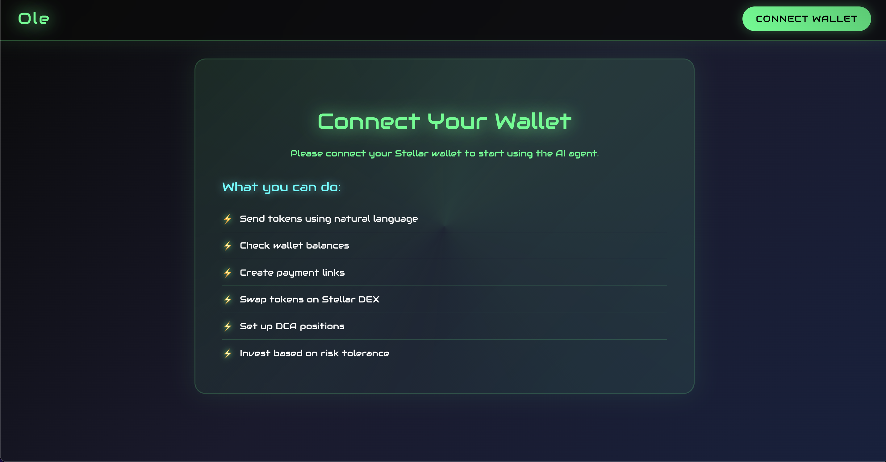
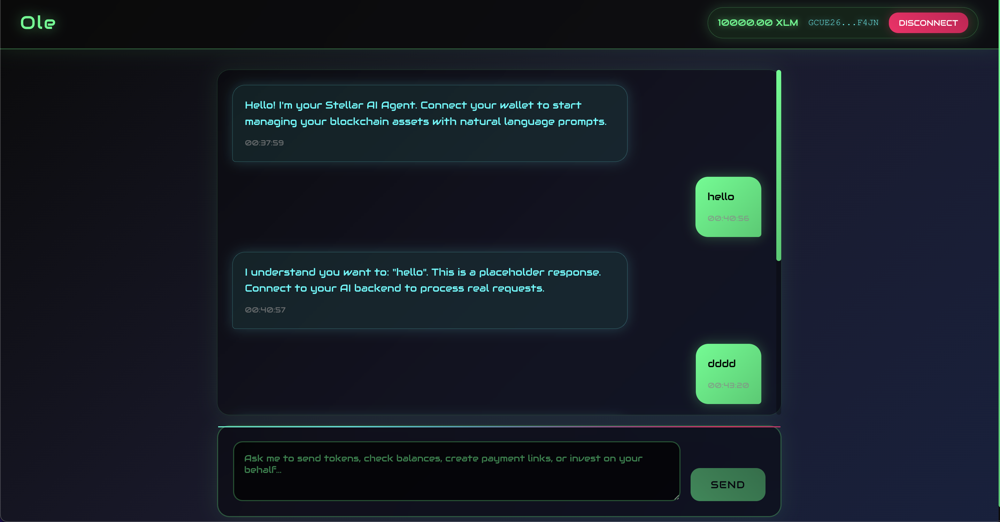

# Stellar AI Agent

## Overview
Stellar AI Agent is an intelligent, conversational assistant for blockchain financial management. It enables users to perform all major blockchain actions—such as sending and receiving tokens, creating payment links, checking balances, swapping assets, managing investments, and automating recurring tasks—using simple natural language prompts. The agent acts as a unified interface, automating complex workflows and providing personalized financial assistance based on user preferences and risk tolerance.

## Problem Statement
Navigating blockchain networks and ecosystems is often a fragmented and overwhelming experience for users. To perform basic and advanced financial actions—such as sending or receiving tokens, investing, or creating payment links—users are forced to jump between multiple platforms, each with its own interface and requirements. This means:

- **Platform Fragmentation**: Users must find and use different platforms for each task (wallet management, payments, trading, investing, etc.), leading to a disjointed experience.
- **Wallet Hassles**: Every time a user visits a new platform, they must create or connect their wallet again, repeating onboarding steps and exposing themselves to potential security risks.
- **Steep Learning Curve**: Each blockchain network and platform introduces new concepts, terminology, and workflows that users must learn before they can confidently interact with the ecosystem.
- **Missed Opportunities**: Users often miss out on market trends, investment opportunities, or timely actions simply because they are busy or unable to monitor the ecosystem constantly.
- **Repetitive Manual Tasks**: Routine actions—like buying tokens daily or setting up recurring investments—require manual intervention, making the process tedious and error-prone.

These challenges create significant friction, discourage adoption, and prevent users from fully leveraging the benefits of blockchain technology. There is a clear need for an intelligent, unified, and user-friendly solution that streamlines blockchain financial management, automates routine and advanced tasks, and empowers users to participate in the ecosystem with ease—all through natural language interactions.

## Solution
The Stellar AI Agent solves these challenges by providing a unified, intelligent, and conversational interface for all blockchain financial activities. Key aspects of the solution include:

- **Unified Platform**: All major blockchain financial actions—sending/receiving tokens, creating payment links, investing, swapping, and more—are accessible from a single, seamless interface.
- **One-Time Wallet Integration**: Users connect their wallet once and can interact with multiple services without repeated onboarding or reconnection.
- **Natural Language Prompts**: The AI agent interprets user instructions in plain language, eliminating the need to understand complex blockchain concepts or technical jargon.
- **Automated and Intelligent Actions**: Routine and advanced tasks (like recurring investments, DCA, or trend monitoring) are automated, saving users time and reducing the risk of error.
- **Personalized Financial Assistant**: The agent can invest on the user's behalf based on their risk tolerance, monitor trends, and alert users to opportunities, ensuring they never miss out due to lack of time or expertise.
- **Frictionless Experience**: By consolidating fragmented workflows and automating repetitive tasks, the Stellar AI Agent empowers users to fully leverage blockchain technology with ease and confidence.

## Features

- **AI-Powered Token Transfers**: Send tokens to any address using simple prompts.
- **Payment Link Creation**: Generate fixed or open payment links for receiving payments or donations.
- **Wallet Balance Checks**: Instantly view your balances for all supported tokens.
- **Token Swaps**: Swap between supported assets directly from the interface.
- **Payment Link Status & History**: Track the status of payment links and view your payment link history.
- **Transaction History**: Review your wallet's transaction history in a unified view.
- **DCA (Dollar Cost Averaging) Positions**: Set up and manage recurring investments in supported tokens.
- **Prompt-Based Investing**: Instruct the agent to invest on your behalf based on your risk tolerance and preferences.
- **Trend Monitoring & Alerts**: Get notified about market trends and investment opportunities automatically.
